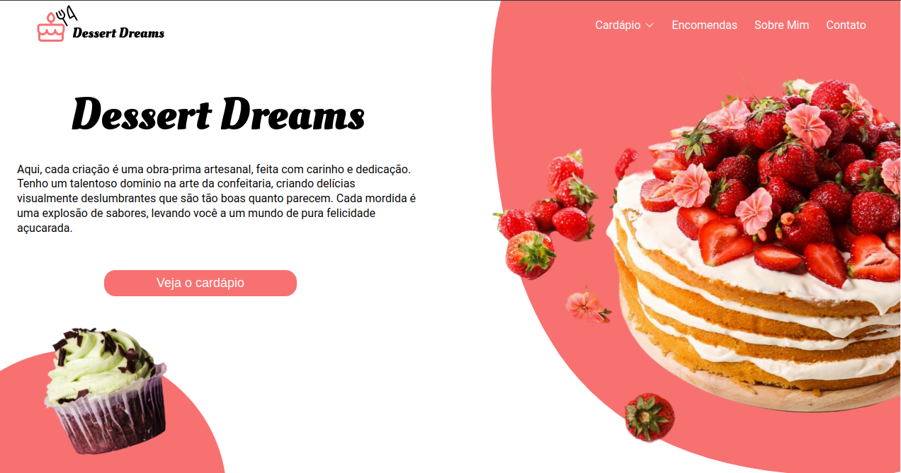
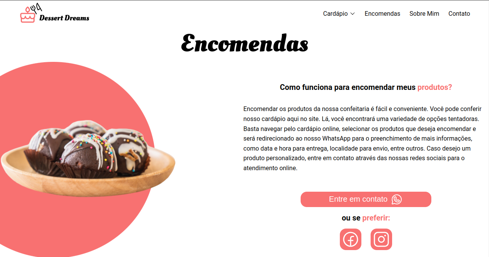
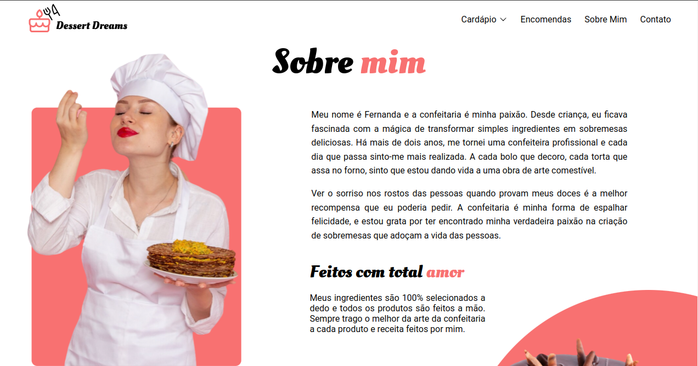

### Projeto independente (Público) - 2023
### ***Dessert Dreams***
#### Sobre o projeto:
 * Site para uma confeitaria fictícia com Web Design feito por mim. Site desenvolvido utilizando o ecossistema React.js(Vite) com Typescript.

### Screenshots do projeto





### Principais tecnologias usadas no desenvolvimento:

* TypeScript
* Vite
* Axios

### Bibliotecas em destaque:

* Zod
* react-hook-form

### Design


### Passo-a-passo para rodar a aplicação:

1. Entre na pasta DessertDreams;
2. use o comando: ***yarn*** ou ***npm install/i*** para instalar os pacotes;
3. use o comando:

```bash
npm run dev
# or
yarn dev
# or
pnpm dev